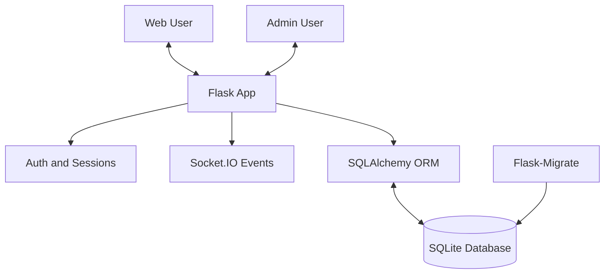
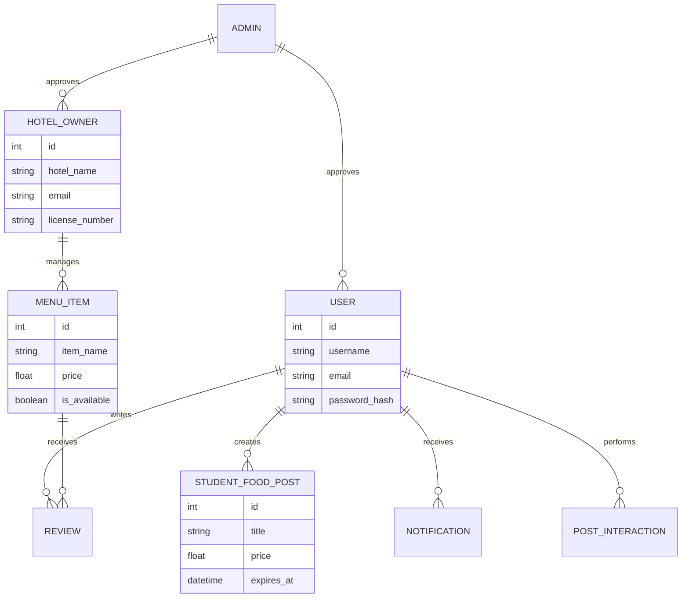
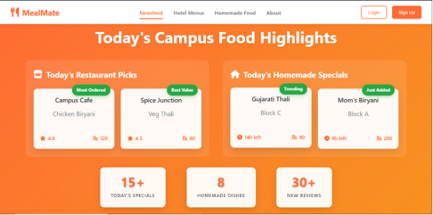
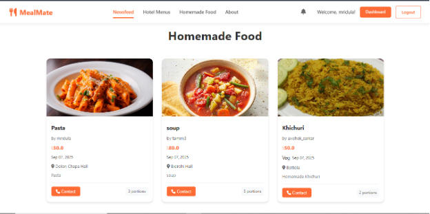
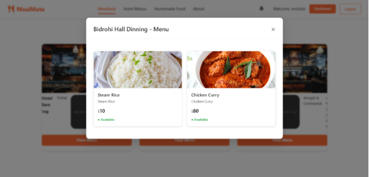
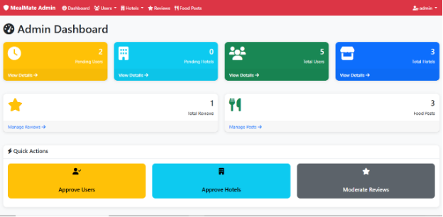

<div align="center">

# MealMate


[](https://flask.palletsprojects.com/)
[](https://socket.io/)
[](https://www.sqlite.org/)
[](LICENSE)

</div>

## Project Overview

MealMate is a real-time food discovery and community platform built for campus ecosystems. It connects students, local restaurants, and student cooks in one place, with live updates and a moderated workflow.

## Why It Matters

- Students can find reliable, affordable meals quickly.
- Student cooks get a practical marketplace to sell homemade food.
- Live reviews and notifications improve trust and decision-making.
- Admin moderation and approvals keep the ecosystem safe.

## Technology Stack

- Backend: Python 3.8+, Flask, SQLAlchemy, Werkzeug, Flask-Migrate
- Real-time: Flask-SocketIO, python-socketio
- Frontend: Jinja2 templates, vanilla JavaScript, CSS
- Database: SQLite (development)
- Configuration: python-dotenv

## System Architecture



## Database Schema



## Key Capabilities

### All-in-One Platform for Foods

- Students can find and compare foods quickly.
- Hotel-owners can update their menus daily. 
- Selling homemade food becomes easy.
- Review system ensures quality. 

### Real-time Notifications

- Live alerts for posts, likes, and comments.
- Personalized notification delivery through Socket.IO rooms.
- Toast-style feedback for non-intrusive updates.

### Authentication and Authorization

- Multi-role login support for students, hotel owners, and admins.
- Session-based auth with Werkzeug password hashing.
- Admin approval flow for controlled onboarding.

### Content Management

- Image upload support for posts and food listings.
- Live content updates across connected users.
- Automatic cleanup support for older content.

### Demo

| Main Homepage | Homemade Food Marketplace |
| --- | --- |
|  |  |
| **Hotel Menu Discovery** | **Admin Control Panel** |
|  |  |

## Security Features

| Feature | Description |
| --- | --- |
| Environment variables | Sensitive values stay out of source code. |
| Input validation | Validates data before persistence. |
| Secure sessions | Uses Flask session handling. |
| Role-based access checks | Route guards for user, owner, and admin sessions. |
| Password hashing | Stores passwords with Werkzeug hash utilities. |
| ORM queries | Reduces SQL injection risk. |

## Installation and Setup

1. Clone the repository.
   ```bash
   git clone https://github.com/avishek-sarkar/MealMate.git
   cd MealMate
   ```
2. Create and activate a virtual environment.
   ```bash
   python -m venv .venv
   .venv\Scripts\activate
   ```
3. Install dependencies.
   ```bash
   pip install -r requirements.txt
   ```
4. Configure environment variables.
   ```bash
   copy .env.example .env
   ```
5. Initialize the database.
   ```bash
   python init_db.py
   ```
6. Run the server.
   ```bash
   python run.py
   ```
   Open http://127.0.0.1:5000

## Default Credentials

| User Type | Username Options | Password | Notes |
| --- | --- | --- | --- |
| Admin | admin | admin123 | Full access |
| Students | avishek_sarkar, tamim5, mridula | password123 | Admin approval required |
| Hotel Owners | hotel_sareng, mastercafe, chondrobindu | hotel123 | Admin approval required |

## Project Structure

```text
MealMate/
├── app.py
├── init_db.py
├── LICENSE
├── models.py
├── README.md
├── requirements.txt
├── run.py
├── .env.example
├── .gitignore
├── instance/
│   └── mealmate.db
├── migrations/
│   ├── alembic.ini
│   ├── env.py
│   ├── script.py.mako
│   └── README
├── static/
│   ├── css/
│   │   ├── styles.css
│   │   └── admin.css
│   ├── js/
│   │   ├── script.js
│   │   └── admin.js
│   └── uploads/
└── templates/
    ├── index.html
    └── admin/
        ├── base.html
        ├── dashboard.html
        ├── food_posts.html
        ├── hotels.html
        ├── login.html
        ├── reviews.html
        └── users.html
```

## API Documentation

See [API_Documentation.md](Documentation/API_Documentation.md) for the complete API reference.

## Future Enhancements

- Mobile app for students and hotel owners.
- Payment integration for direct transactions.
- Recommendations and smarter discovery.
- Delivery workflow and order tracking.
- Production stack upgrades (PostgreSQL, Docker, CI/CD, caching, monitoring).

## Contributing

Contributions are welcome. Please report bugs, suggest improvements, or open pull requests with focused changes.

### Contributors

<p align="center">
   <a href="https://github.com/avishek-sarkar/MealMate/graphs/contributors">
      
   </a>
</p>

---

## Outro

MealMate brings campus food communities together with real-time updates, trustworthy reviews, and structured moderation. Thanks for taking some time to visit this repository. 
